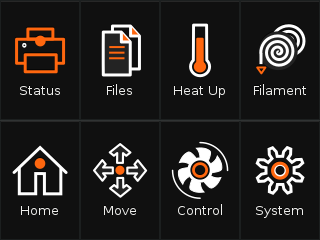
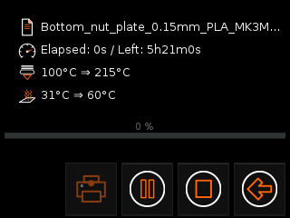
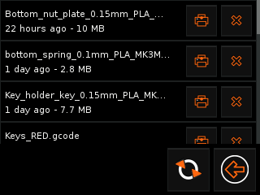
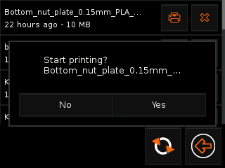
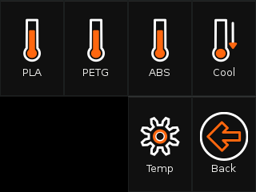
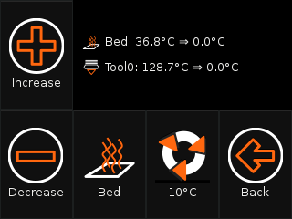

OctoPrint-TFT [](https://github.com/mcuadros/OctoPrint-TFT/releases) []()
=============
### My changes to the original software (I'm also working on some bugs):

- Changed the order of the homescreen elements
- Reworked status screen to have more space for the important stuff and smaller buttons
- Reworked files list:
  - Added delete function
  - Removed the load button (for small screens). If you want to load a file press print and in the dialog press "no"
  - Reload every time when the list is opened
  - More narrow list elements for small screens
- Changed temperature pages order. When you press temp, you get the presets first and can press a button to get to the finetune settings
- Improved contrast and color
- Lots of other changes to make it look good even on 320x240 pixel screens (you can run it bigger screens anyway)
- Profiles from OctoPrint should be working now (thanks to blondak).

At the moment SD card is removed (because I created this fork for myself in the first place) - I'll add it back soon.

     

### Original description:

_OctoPrint-TFT_, a touch interface for TFT touch modules based on GTK+3.

Is a _X application_ to be executed directly in the X Server without any windows
manager, as _frontend of a [OctoPrint](http://octoprint.org) server_ in a Raspberry Pi
equipped with any [TFT Touch module](https://www.waveshare.com/wiki/3.5inch_RPi_LCD_(A)).

Allows you to control your 3D Printer, like you can do with any [TFT/LCD panel](http://reprap.org/wiki/RepRapTouch), but using _OctoPrint_ and a Raspberry Pi.

### These are some of the functionalities supported:

- Print jobs monitoring.
- Temperature and Filament management.
- Jogging operations.

### How this is different from TouchUI?

[TouchUI](http://plugins.octoprint.org/plugins/touchui/), is an amazing plugin
for Octoprint, was created as a responsive design for access to OctoPrint,
from low resolution devices, such as smartphones, tablets, etc.

Executing TouchUI under a RPi w/TFT modules, presents two big problems,
first isn't optimized to be used with resistive touch screens with low resolutions
like 480x320 and second requires a browser to be access, consuming a lot of
resources.

This is the main reason because I develop this X application to be executed
in my 3d printer.

Installation
------------

### Dependencies

*OctoPrint-TFT* is based on [Golang](golang.org), usually this means that is
dependency-less, but in this case [GTK+3](https://developer.gnome.org/gtk3/3.0/gtk.html)
is used, this means that GTK+3 libraries are required to be installed on
the system.

If you are using `Raspbian` or any other `Debian` based distribution, GTK+3 can
be installed using:

```sh
sudo apt-get install libgtk-3-0
```
OctoPi does not come with graphical environment, additionally install:

```sh
sudo apt-get install xserver-xorg xinit
```


### Install from source

The compilation and packaging tasks are managed by the [`Makefile`](Makefile)
and backed on [Docker](Dockerfile). Docker is used to avoid installing any other
dependencies since all the operations are done inside of the container.

If you need to install docker inside `Raspbian` or any other linux distrubution
just run:

```sh
curl -fsSL get.docker.com -o get-docker.sh
sh get-docker.sh
```

> You can read more about this at [`docker-install`](https://github.com/docker/docker-install)

Install git and clone this repository:

```sh
sudo apt-get install git -y
git clone https://github.com/noxhirsch/OctoPrint-TFT
```

To compile just execute the `build` target, this will generate in `build` folder all the binaries
and debian packages. This will take a while (10-20mins on a Raspberry Pi 3):

```sh
sudo make build
ls -1 build/
```

If you are using `Raspbian` you can install any of the `.deb` generated packages.
If not, just use the compiled binary. Example:

```sh
cd build/jessie
ls
```

Now you can see the filename of the package. Use it to run this command:

```sh
dpkg -i octoprint-tft_0.1.0-1.jessie_armhf.deb
```

Configuration
-------------

### Basic Configuration

The basic configuration is handled via environment variables, if you are using
the `.deb` package you can configure it at `/etc/octoprint-tft-environment`.

- `OCTOPRINT_CONFIG_FILE` - Location of the OctoPrint's config.yaml file. If empty the file will be searched at the `pi` home folder or the current user. Only used for locally installed OctoPrint servers.

- `OCTOPRINT_HOST` - OctoPrint HTTP address, example `http://localhost:5000`, if OctoPrint is locally installed will be read from the config file.

- `OCTOPRINT_APIKEY` - OctoPrint-TFT expects an [API key]( http://docs.octoprint.org/en/master/api/general.html) to be supplied. This API key can be either the globally configured one or a user specific one if “Access Control”. if OctoPrint is locally installed will be read from the config file.

- `OCTOPRINT_TFT_STYLE_PATH` - Several themes are supported, and style configurations can be done through CSS. This variable defines the location of the application theme.

- `OCTOPRINT_TFT_RESOLUTION` -  Resolution of the application, should be configured to the resolution of your screen, for example `800x480` or `480x320`. By default it is `320x240`.


### Custom controls and commands

Custom [controls](http://docs.octoprint.org/en/master/configuration/config_yaml.html#controls) to execute GCODE instructions and [commands](http://docs.octoprint.org/en/master/configuration/config_yaml.html#system) to execute shell commands can be defined in the `config.yaml` file.

The controls are limit to static controls without `inputs`.

License
-------

GNU Affero General Public License v3.0, see [LICENSE](LICENSE)

The artwork being use in the at the [default style](`styles/default`) created by [@majurca](https://github.com/majurca) is under the lincese [Attribution 3.0 Unported (CC BY 3.0)](https://creativecommons.org/licenses/by/3.0/)
