# Available panels

You can define your own menu structure using [Z-Bolt-OctoScreen](https://github.com/Z-Bolt/OctoPrint-Z-Bolt-OctoScreen). Plugin uses JSON format for menu configuration. [Here is a default config](DefaultConfig.md). Below is a list of available menu items.

### Home
Config example:
```
{
  "name": "Home",
  "icon": "home",
  "panel": "home"
}
```
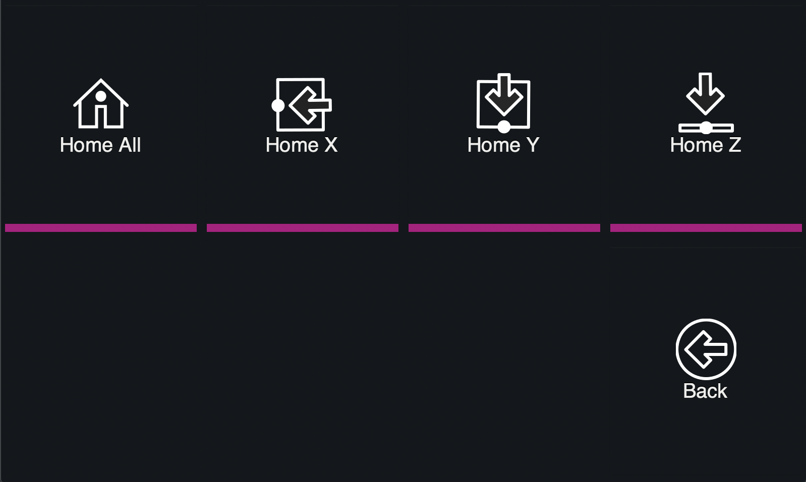
<br />
<br />
<br />
<br />


### Filament
Config example:
```
{
  "name": "Filament",
  "icon": "filament",
  "panel": "filament"
}
```

<br />
<br />
<br />
<br />


### Move
Config example:
```
{
  "name": "Move",
  "icon": "move",
  "panel": "move"
}
```
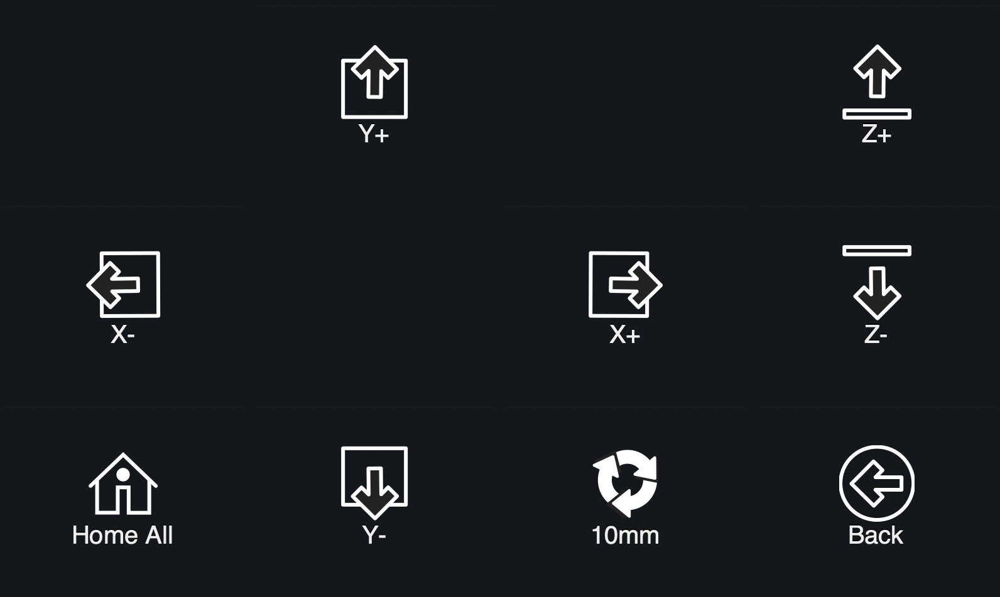
<br />
<br />
<br />
<br />


### Fan
Config example:
```
{
  "name": "Fan",
  "icon": "fan",
  "panel": "fan"
}
```
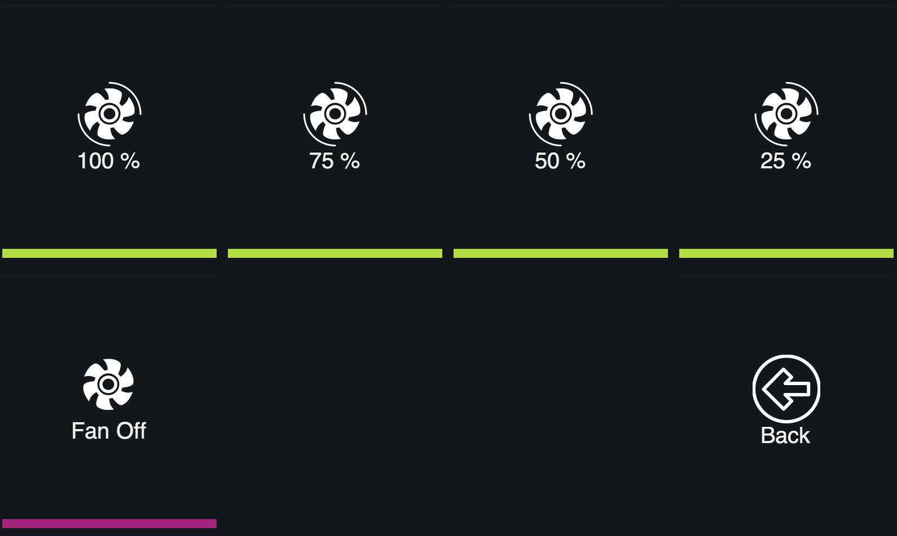
<br />
<br />
<br />
<br />


### Temperature
Config example:
```
{
  "name": "Temperature",
  "icon": "heat-up",
  "panel": "temperature"
}
```
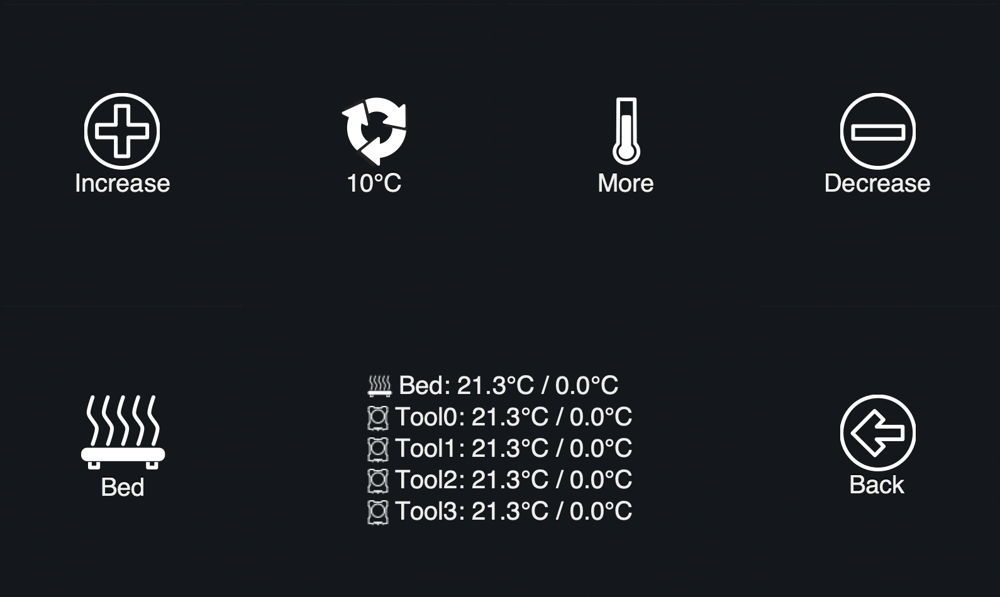
<br />
<br />
<br />
<br />


### Temperature Presets
Config example:
```
{
  "name": "Presets",
  "icon": "heat-up",
  "panel": "temperature-presets"
}
```
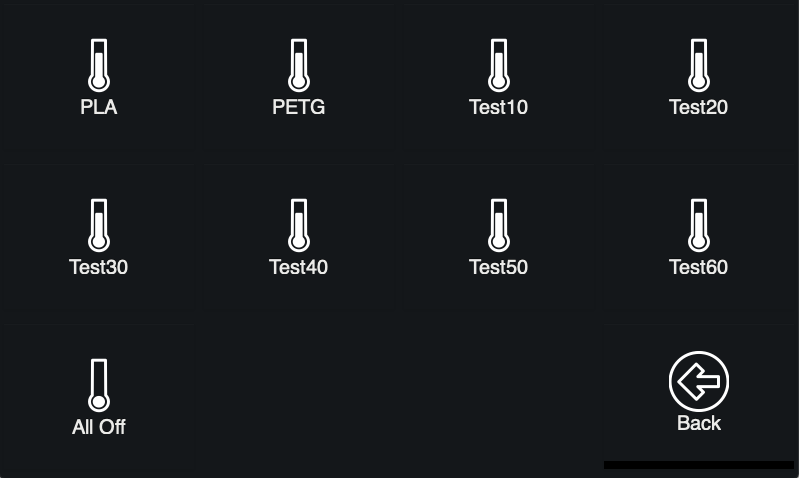
<br />
<br />
<br />
<br />


### Control
Config example:
```
{
  "name": "Control",
  "icon": "control",
  "panel": "control"
}
```
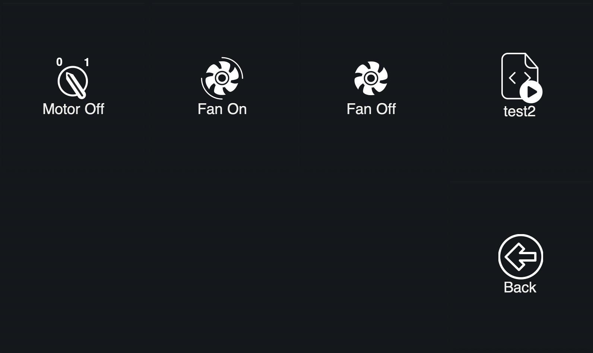
<br />
<br />
<br />
<br />


### Bed leveling
Config example:
```
{
  "name": "Bed Level",
  "icon": "bed-level",
  "panel": "bed-level"
}
```
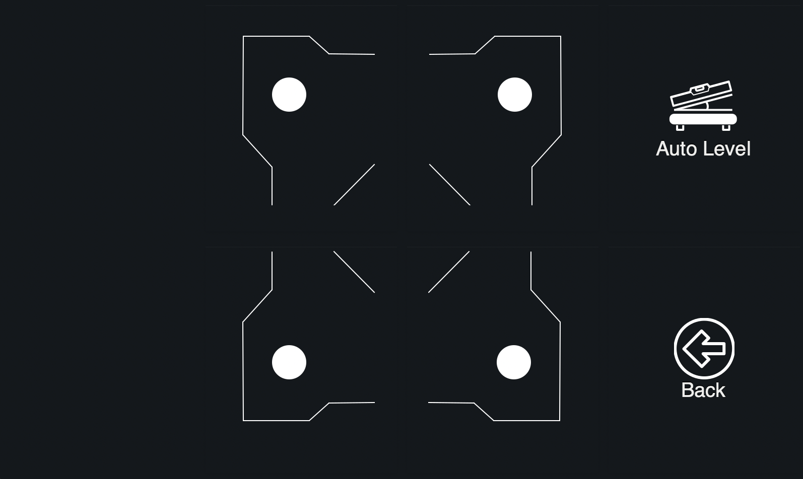
<br />
<br />
<br />
<br />


### Network
Config example:
```
{
  "name": "Network",
  "icon": "network",
  "panel": "network"
}
```
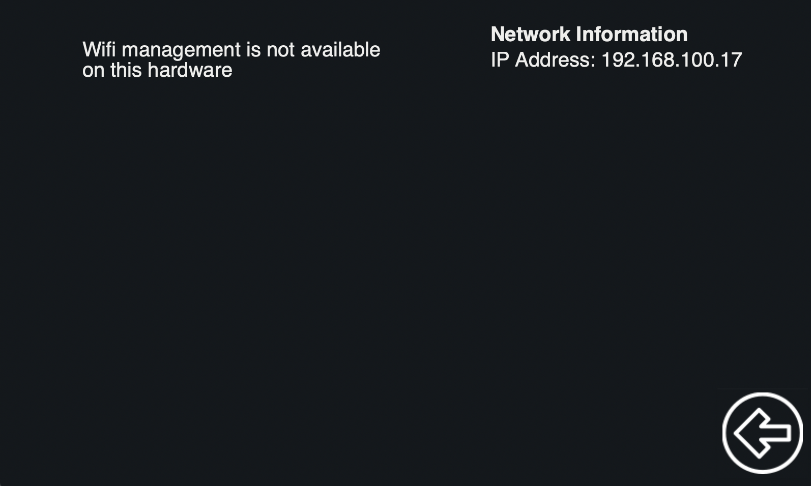
<br />
<br />
<br />
<br />


### System info and commands
Config example:
```
{
  "name": "System",
  "icon": "info",
  "panel": "system"
}
```
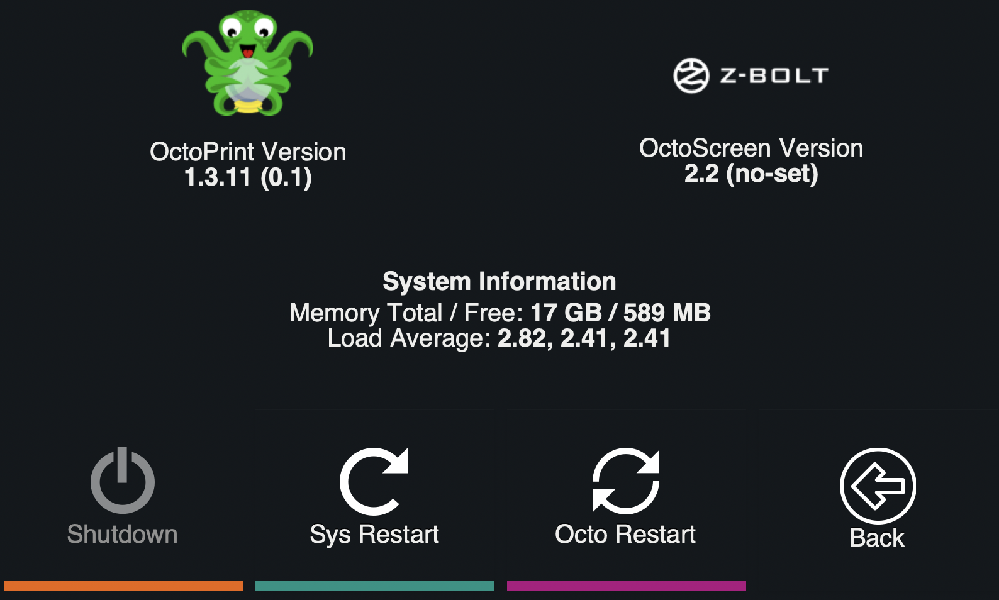
<br />
<br />
<br />
<br />


### Z-Offset Calibration
Config example:
```
{
  "name": "ZOffsets",
  "icon": "z-offset-increase",
  "panel": "z-offset-calibration"
}
```
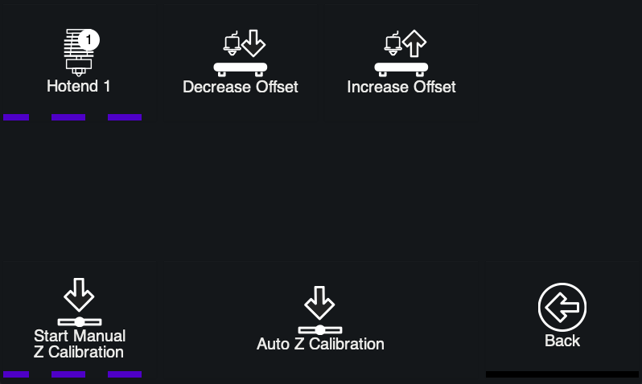
<br />
<br />
<br />
<br />


### Tool Changer
Config example:
```
{
  "name": "Tool Changer",
  "icon": "tool-changer",
  "panel": "tool-changer"
}
```
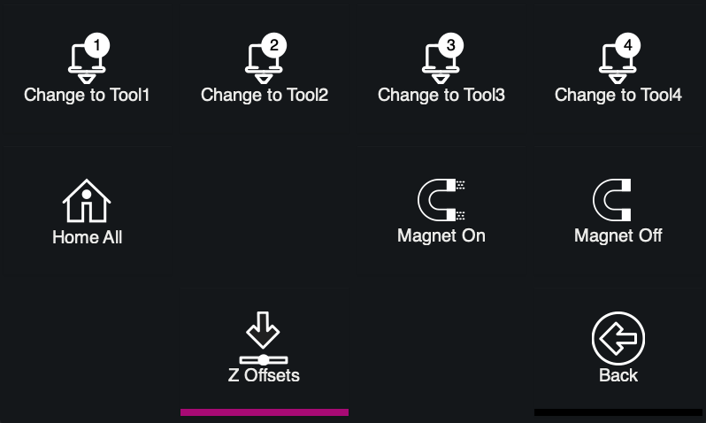
