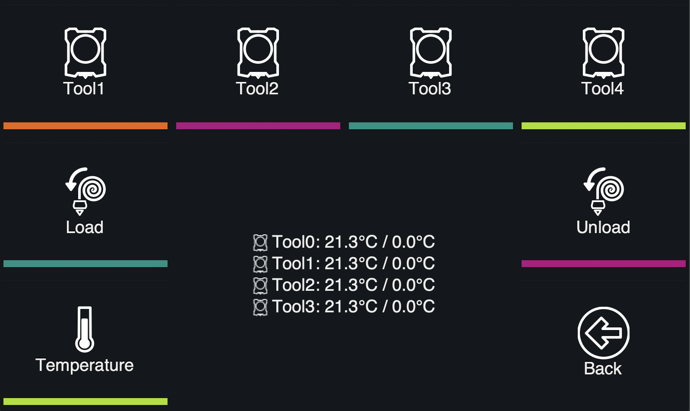
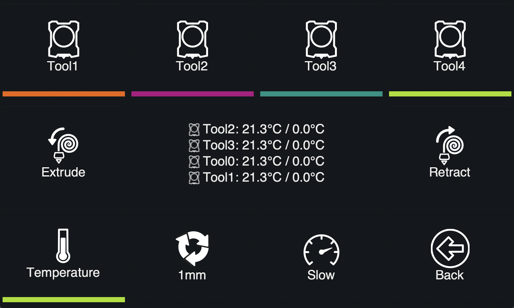
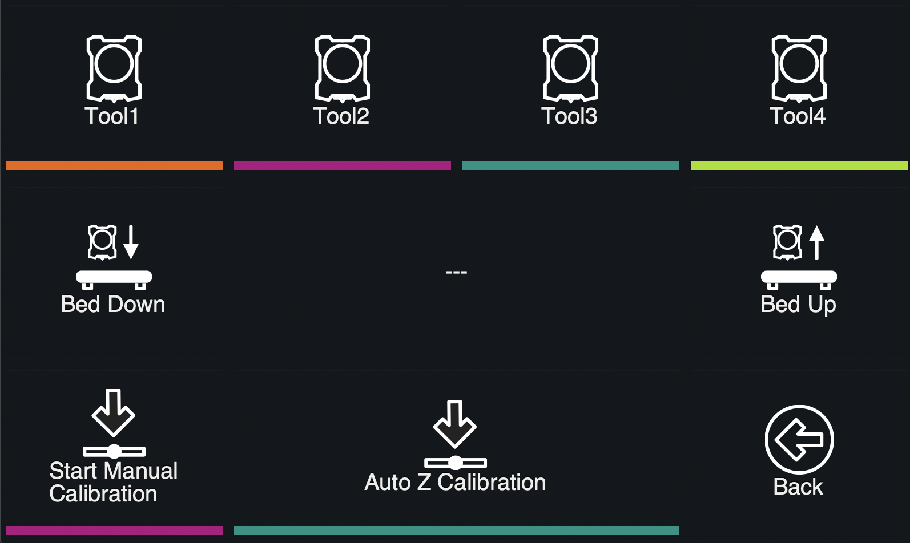
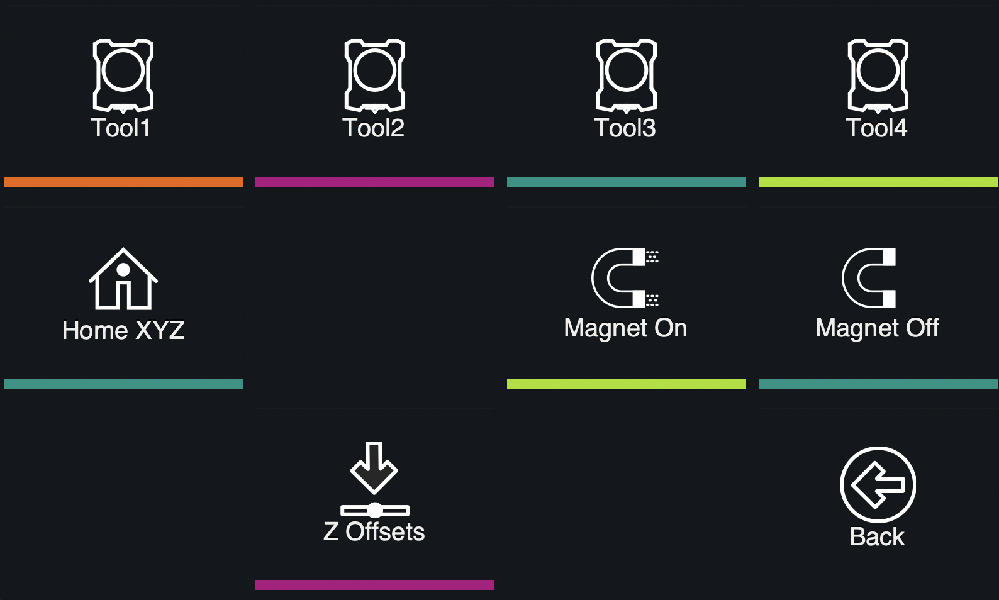

# Available panels

You can define your own menu structure using [Z-Bolt-OctoScreen](https://github.com/Z-Bolt/OctoPrint-Z-Bolt-OctoScreen). Plugin uses JSON format for menu configuration. [Here is a default config](DefaultConfig.md). Below is a list of available menu items.

### Home
Config example:
```
{
  "name": "Home",
  "icon": "home",
  "panel": "home"
}
```


### Extrusion and filament changing
Config example:
```
{
  "name": "Filament",
  "icon": "filament",
  "panel": "filament"
}
```


Config example:

```
{
  "name": "Extrude",
  "icon": "filament",
  "panel": "filament_multitool"
}
```


Config example:

```
{
  "name": "Extrude",
  "icon": "filament",
  "panel": "extrude_multitool"
}
```


### Move
Config example:
```
{
  "name": "Move",
  "icon": "move",
  "panel": "move"
}
```


### Fan
Config example:
```
{
  "name": "Fan",
  "icon": "fan",
  "panel": "fan"
}
```


### Bed leveling
Config example:
```
{
  "name": "Bed Level",
  "icon": "bed-level",
  "panel": "bed-level"
}
```


### Temperature Management
Config example:
```
{
  "name": "Temperature",
  "icon": "heat-up",
  "panel": "temperature"
}
```


### Octoprint Custom commands
Config example:
```
{
  "name": "Control",
  "icon": "control",
  "panel": "control"
}
```


### Network
Config example:
```
{
  "name": "Network",
  "icon": "network",
  "panel": "network"
}
```


### System info and commands
Config example:
```
{
  "name": "System",
  "icon": "info",
  "panel": "system"
}
```


### Nozzle Calibration
Config example:
```
{
  "name": "ZOffsets",
  "icon": "z-offset-increase",
  "panel": "nozzle-calibration"
}
```


### Toolchanger
Config example:
```
{
  "name": "ToolChanger",
  "icon": "toolchanger",
  "panel": "toolchanger"
}
```


